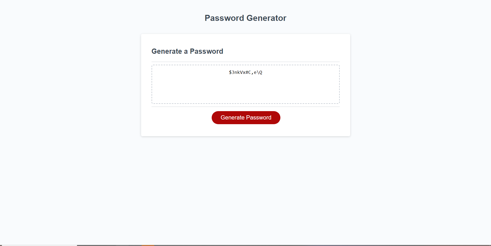

# <Password-Generator>

## Description

I was tasked to develop a webpage that generated a random password using JavaScript. The website gave users the option on how many charaters they wanted and what kind of charaters they wanted. For example it would ask if they wanted numbers in the password.

## Installation

I copied the challange code from the github repository, after that i started to work on my git bash to put it in my own repository. I used the mini project from the javascript activites to guide me on building this webpage. Furthermore i got additional help from w3schools, the Xpert learning assistant, stack overflow, and MDN web docs. after adding the needed code JavaScript code I pushed all my updates through git bash and made the site live.

## Usage

The purpose of this website is to help improve on my JavaScript skills and also to help produce strong passwords for users who use the site.

## Credits

w3schools,
Xpert learning assistant,
stack overflow,
MDN web docs,
mini project from the javascript activites

## Website
https://unevailable.github.io/Password-Generator/

## License

MIT License

Copyright (c) 2023 Unevailable

Permission is hereby granted, free of charge, to any person obtaining a copy
of this software and associated documentation files (the "Software"), to deal
in the Software without restriction, including without limitation the rights
to use, copy, modify, merge, publish, distribute, sublicense, and/or sell
copies of the Software, and to permit persons to whom the Software is
furnished to do so, subject to the following conditions:

The above copyright notice and this permission notice shall be included in all
copies or substantial portions of the Software.

THE SOFTWARE IS PROVIDED "AS IS", WITHOUT WARRANTY OF ANY KIND, EXPRESS OR
IMPLIED, INCLUDING BUT NOT LIMITED TO THE WARRANTIES OF MERCHANTABILITY,
FITNESS FOR A PARTICULAR PURPOSE AND NONINFRINGEMENT. IN NO EVENT SHALL THE
AUTHORS OR COPYRIGHT HOLDERS BE LIABLE FOR ANY CLAIM, DAMAGES OR OTHER
LIABILITY, WHETHER IN AN ACTION OF CONTRACT, TORT OR OTHERWISE, ARISING FROM,
OUT OF OR IN CONNECTION WITH THE SOFTWARE OR THE USE OR OTHER DEALINGS IN THE
SOFTWARE.